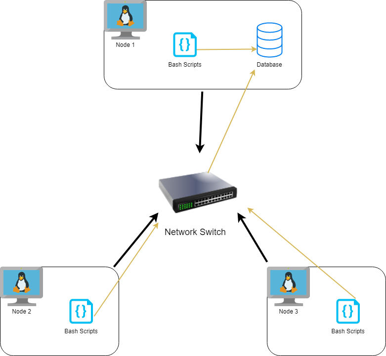

# Linux Cluster Monitoring Agent

## Introduction
The Linux Cluster Monitoring Agent is a tool for the Jarvis Linux Cluster Administration (LCA) 
team managing a Linux cluster of 10 nodes / servers running CentOS 7 to monitor each node. 
The Linux Cluster Monitoring Agent records the hardware specifications of each node and monitors
each node resource usages (such as CPU and Memory usage) in real time. The hardware specifications
and resource usages are stored in a Relational Database Management System (RDBMS) which the
LCA team can then use to generate reports for future resource planning purposes.

To ensure that the Linux Cluster Monitoring Agent will deploy and work on all nodes, Docker 
is used to keep consistency between nodes. Docker will create a container for the PostgreSQL (PSQL)
instance and will be the connection to store data into the database. The Linux Cluster 
Monitoring Agent will run every minute and record the resource usage. This collected data
will be used by the LCA for improvements and changes.

## Architecture and Design


As described above in the Linux Cluster Monitoring Agent Architecture and Design diagram, the Bash (Host) agent scripts
are run on every node in the Linux Cluster and will be stored into the database. For the nodes to communicate
with each other, they are connected to a network switch. This will allow access and communication between 
all nodes and the database. 

## Database & Tables
The database, `host_agent`, consists of two tables: `host_info` and `host_usage`. The `host_info`
table will collect all Hardware Specification information of each node in the cluster, while
the `host_usage` table will collect resource usage in intervals of one minute. 

The following are the hardware specifications stored in the `host_info` table:

Hardware Specification | Description 
------- | -------
id | Unique id number corresponding to each node, it is a *primary key* in the table and is autogenerated by PostgreSQL
hostname | Hostname of the node and will be unique between nodes
cpu_number | The number of cores that the node is using
cpu_architecture | The architecture which the CPU is running
cpu_model | The specific model of CPU
cpu_mhz | The operating frequency of the CPU 
L2_cache | The L2 cache size of the node
total_mem | The total memory of the node
timestamp | The time and date during execution of this data collection

The following are the resource usage data collected in the `host_usage` table:

Resource Usage | Description
------ | ------
timestamp | The time and date during execution of this data collection
host_id | The unique  id number of each node, *foreign key* to `id` in the `host_info` table
memory_free | The amount of memory that is available
cpu_idle | The percentage of CPU idle 
cpu_kernel | The percentage of CPU time executing kernel processes
disk_io | The disk input and output usage 
disk_available | The amount of available disk space

## Script Descriptions
* *[psql_docker.sh](https://github.com/jarviscanada/jarvis_data_eng_TuanMai/blob/develop/linux_sql/scripts/psql_docker.sh)* - 
is used to create a docker container or start/stop a container if one exists

* *[host_info.sh](https://github.com/jarviscanada/jarvis_data_eng_TuanMai/blob/develop/linux_sql/scripts/host_info.sh)* - 
is run once for every node in the cluster to gather hardware configuration information about the node and store into the `host_info` table

* *[host_usage.sh](https://github.com/jarviscanada/jarvis_data_eng_TuanMai/blob/develop/linux_sql/scripts/host_usage.sh)* - 
is ran once every minute (via Crontab) to collect various resource usages of a node 

* *[ddl.sql](https://github.com/jarviscanada/jarvis_data_eng_TuanMai/blob/develop/linux_sql/sql/ddl.sql)* - 
is used to automate the creation of the two tables `host_info` and `host_usage` inside the `host_agent` database

* *[queries.sql](https://github.com/jarviscanada/jarvis_data_eng_TuanMai/blob/develop/linux_sql/sql/queries.sql)* - 
is used to get information on the cluster and manage the different usages
    1. Group hosts by CPU number and sort by their memory size in descending order within each `cpu_number` group
    2. Calculating and displaying the average amount of memory used over a 5-minute interval of each node
    
## Usage
#####1. Database and Table Initialization
In order to create the database and table, the PostgreSQL instance must be provisioned and running.
To create the PSQL Docker container and tables, run the following: 

```shell script
# --- In Terminal ---

# Run tyhe psql_docker.sh to create a PSQL Docker container with the given username and password of your choice
./linux_sql/scripts/psql_docker.sh create db_username db_password

# Create and initialize the database and tables
psql -h psql_host -d psql_database -U psql_user -W linux_sql/sql/ddl.sql
```

#####2. *host_info.sh* Usage
This script will only be required to run once on each new node. This will gather the hardware specifications 
and store it into the `host_info` table.

```shell script
# --- In Terminal ---

# Collect hardware specifications and store into the host_info table
./linux_sql/scripts/host_info.sh psql_host psql_port db_name psql_user psql_password
```

#####3. *host_usage.sh* Usage
This script will gather the node's current resource usage and store them into the `host_usage` table.

```shell script
# Collect current resource usage and store into the host_usage table
./linux_sql/scripts/host_usage.sh psql_host psql_port db_name psql_user psql_password
```

#####4. Crontab setup
To get the script to run every minute, crontab jobs are able to repeatedly run certain scripts with the specified time interval given

```shell script
# --- In Terminal ---
# Run this to get to the crontab editor
crontab -e

# Enter this in one line to specify a job
# The asterisks represent 1-minute
* * * * * bash [full path]/host_usage.sh  psql_host psql_port db_name psql_user psql_password > /tmp/host_usage.log

# Verify that crontab has your active job
crontab -ls

# Verify the scripts have been running as intended by checking the log file
cat /tmp/host_usage.log
```

##Improvements
1. The Linux Cluster Monitoring Agent can be improved be having a check to see if any of the nodes have 
stopped communicating or failed and report that to the LCA. 
2. It would be go to create a redundant system to back up the data in case one of the databases has issues