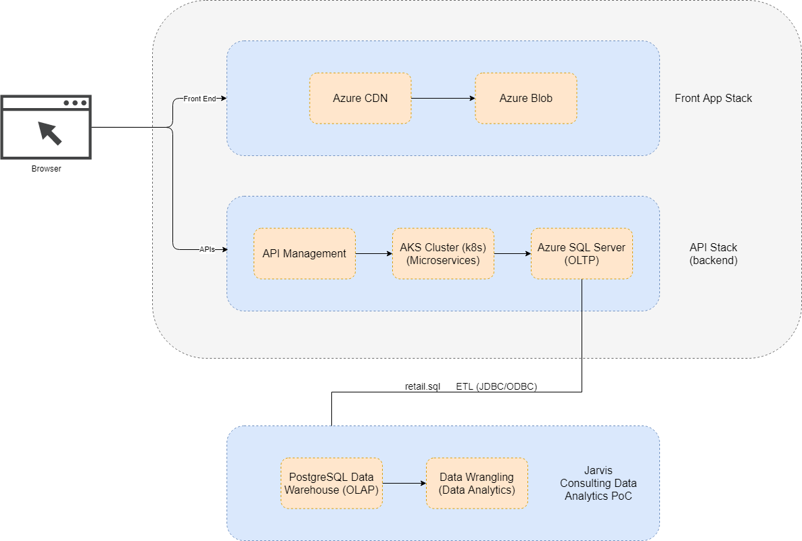

# Introduction
London Gift Shop (LGS), a UK-based online store selling gifts has recently been seeing no growth in revenue. 
As such, the LGS marketing team wants to utilize the latest data technologies to get an understanding of their customer 
base to help increase sales and create efficient marketing techniques. 

This project provides a proof of concept (PoC) project that delivers data to help aid the LGS marketing team. 
As this is a PoC project, this project will not be using LGS Azure environments and will be using sample SQL data 
provided by the LGS team of transactions between 01/12/2009 and 09/12/2011. The project will answer all business 
questions that the project owner and data analysts have created to analyze new marketing strategies. Data analytics 
will be performed using Python, Pandas, and Jupyter Notebook. The data provided will be stored in a PostgreSQL 
database, and solutions are written into a Jupyter notebook.

# Project Architecture

High level overview of the Python Data Analytics Architecture.

The architecture for the Python Data Analytics PoC for the London Gift Shop team. The LGS team uses Microsoft Azure as the
API stack for their backend, which using Azure's Content Delivery Network to manage the front end stack. The backend 
operates as a microservice utilizing Azure Kubernetes Service (AKS) for processing with a SQL server for the online 
transactional processing data. However, access to the Azure servers were not allowed as the provided SQL data was 
stored into a PostgreSQL data warehouse. This data was used to perform analysis on in a Jupyter Notebook.

# Data Analytics and Wrangling
The Jupyter Notebook proof of concept for the python data analytics can be found: [here](./retail_data_analytics_wrangling.ipynb)
The data will be used to help the LGS to increase their revenue by performing different business analytics based 
on the interest of the LGS team. This includes determining the amount of new users versus existing users, total 
invoice amounts per month, monthly sales growth. The benefit of performing the data analytics in the Jupyter 
notebook is the ability to display visualization of the data. Upon reviewing the different analysis, a new market strategy 
that the LGS team may use to improve their growth is to review the "Loyal Customers" segment to reward those customers 
who are loyal, or reward users from the "Champion" segments as they continue to make large purchases.  

# Improvements
1. Perform analysis on a more recent and wider range of data
2. Perform more RFM segmentation and use the data to determine more marketing strategies
3. Come up with more predictive strategies based on users and segment groups