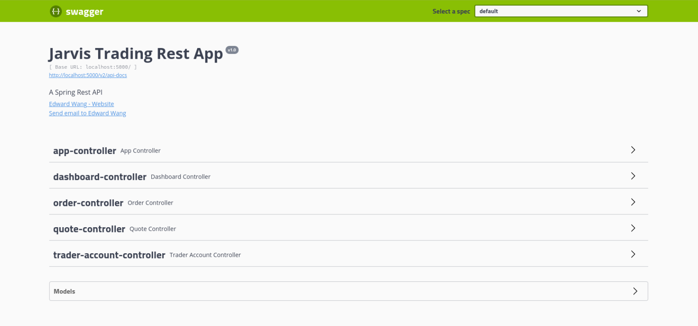
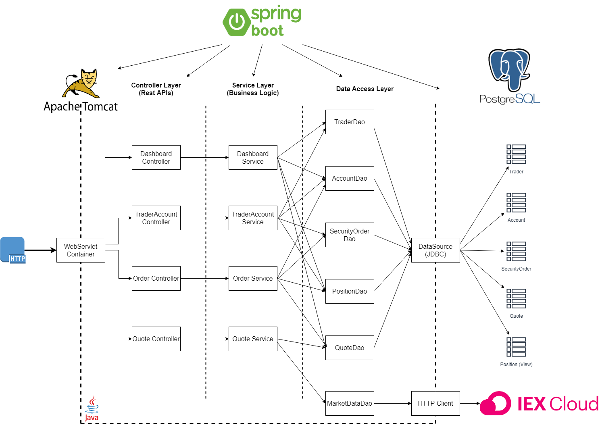
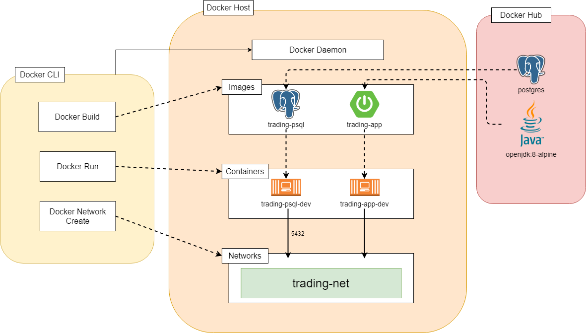

# Table of contents
* [Introduction](#Introduction)
* [Quick Start](#Quick-Start)
* [Architecture](#Architecture)
* [REST API Usage](#REST-API-Usage)
* [Docker Deployment](#Docker-Deployment)
* [Improvements](#Improvements)

# Introduction
The Springboot project centralizes on building an online trading simulation application. The project uses REST API to allow users to 
create and manage their trader account, while using it to make orders and trade on the market. This API is perfect for many users, 
such as front-end developers, mobile developers, as well as traders could easily use this application with Swagger. This application is a 
MicroService which is implemented with Springboot for dependency injection. The application stores trader accounts, quotes, orders onto 
a PSQL database. The IEX Market Data are stored on and used from IEX Cloud's API. 

# Quick Start
- Prequiresites: Docker, CentOS 7

- Docker scritps 
    - Ensure you are running Docker version 17.05 or higher
    ```shell script
       # Check version with 
       docker -v
    ```
  
	- Build Docker Images:
	```shell script
    # Build the PSQL Image
    cd ./springboot/psql
    docker build -t trading-psl .
   
    # Build the Trading App Image
    cd ./springboot
    dokcer build -t trading-app .
    ```
  - Create docker network
   ```shell script
      # Create a docker network
      sudo docker network create trading-net
    
      # Verify that it is running
      docker network ls
   ```
  - Ensure all containers have started
  ```shell script
     # Start the PSQL container
     docker run --name trading-psql-dev \
     -e POSTGRES_PASSWORD=password \
     -e POSTGRES_USER=postgres \
     --network trading-net \
     -d -p 5432:5432 trading-psql
  
     # Start the Trading App container
     #set IEX credential
     IEX_PUB_TOKEN="your_token"
     #start trading-app container which is attached to the trading-net docker network
     docker run --name trading-app-dev \
     -e "PSQL_URL=jdbc:postgresql://trading-psql-dev:5432/jrvstrading" \
     -e "PSQL_USER=postgres" \
     -e "PSQL_PASSWORD=password" \
     -e "IEX_PUB_TOKEN=${IEX_PUB_TOKEN}" \
     --network trading-net \
     -p 8080:8080 -t trading-app
  ```
  - Try trading-app with SwaggerUI on your web browser at http://localhost:8080/swagger-ui.html
  
  

# Architecture


##### Controller layer
The controller layer handles the HTTP requests of the application, managing the control of data and logic. The controller layer 
retrieves data from the API requests and changes the information to a better form to be passed to the service layer.   

##### Service layer
The service layer handles the business logic of the application which involves performing validation on data being sent. 
Validation to ensure that there are enough stocks to purchase and balance in trader account before making the purchase. 
The service layer will make respective calls to the DAO layer to pass the data for further processing. 

##### DAO layer
The DAO layer is the Data Access Object layer which deals with data persistence as well as getting and saving data to the database. 
The DAO will also update quotes to the IEX Cloud through an HTTP Client. 

##### SpringBoot: webservlet/TomCat and IoC
This application uses Springboot for dependency injection as well as managing the instantiating, creating beans, and going through 
their lifecycle. There is also a default Tomcat webservlet which is created that handles the API requests. 

##### PSQL and IEX
PSQL, PostgreSQL is the database used to host our application's data such as account information. IEX is the cloud service that 
provides a REST API for market data. We will be store quote data onto IEX Cloud.

# REST API Usage
## Swagger
Swagger allows you to describe the structure of your APIs so that machines can read them. Swagger is perfect for development 
teams or end consumers to visualize and interact wth the API's resources without having any of the implementation logic in place. 
This is automatically generated from OpenAPI (formerly Swagger) Specification, with visual documentation making it easy for back end 
implementation and client side consumption. 

## Quote Controller
The Quote Controller is a controller that handles gathering quote market data from IEX Cloud which is mapped to an object and cached 
into the PSQL database. The Quote Controller has the following endpoints: 

  - GET `/quote/dailyList`: list all securities that are available to trading in this trading system.
  - GET `/quote/iex/ticker/{ticker}`: list the IEX Quote information of the given ticker
  - PUT `/quote/iexMarketData`: update the quote information from IEX 
  - PUT `/quote/`: update the quotes 
  - POST `/quote/tickerId/{tickerId}`: Saves a new quote based on the ticker 
## Trader Controller
The Trader Controller is a controller that handles the traders and accounts of individuals that gets stored into the database. The
Trader Controller also manages the withdrawal and deposit of funds for a trader. The Trader Controller has the following endpoints: 

   - POST `/trader/firstname/{firstname}/lastname/{lastname}/dob/{dob}/country/{country}/email/{email}`: create a new trader with the given information and store to database
   - POST `/trader/`: store the retrieved trader object into the database
   - DELETE `/trader/traderId/{traderId}`: delete the trader account with the given traderId
   - PUT `/trader/traderId/{traderId}/amount/{amount}`: deposit the amount specified into the trader account based on traderId
   - PUT `/trader/withdraw/traderId/{traderId}/amount/{amount}`: withdraw the amount specified from the trader account based on traderId. Amount cannot be greater than the balance.

## Order Controller
The Order Controller is a controller that handle the execution of the placement for buying and selling orders.
The Order Controller has the following endpoint:

   - POST `/order/marketOrder`: execution attempts to buy or sell an order depending on the size. If the size is positive, attempt to buy an order, 
   if the size is negative, attempt to sell an order. 

# Docker Deployment


- `trading-psql` docker image based on the official Postgres docker image. This image will contain .sql scripts to build tables and initialize them. 
- `trading-app` docker image based on the openjdk:8-alpine image. This image will compile the code using Maven on a container and then run the application.

# Improvements
1. Allow the user to be able to place multiple orders 
2. Implement a way for users to be able to place orders in a queue
3. Allow users to enter in credentials in commandline instead of environmental variables
4. Add Dashboard Controller 
5. Add more documentation to code